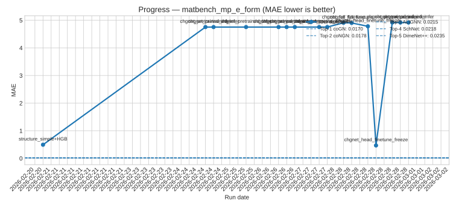
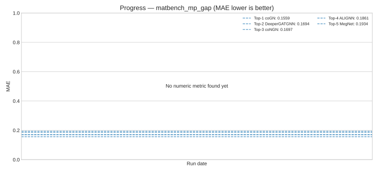

# MALTbot🦞

## Documentation

- [Matbench Ops Rules](docs/MATBENCH_OPS.md)
- [Daily Colab Run](docs/colab.md)
- [Progress Plot Automation](docs/progress.md)

## CHGNet finetune track (`matbench_mp_e_form`)

- Canonical notebook (batch): `notebooks/MALTbot_2.ipynb`
- Experiment registry: `configs/experiments/*.yaml`
- Batch runner: `scripts/run_experiment.py`
- Base CHGNet config: `configs/chgnet_mp_e_form.yaml`
- Results artifact: `results/daily/<DATE>/<BATCH_RUN_NAME>/<exp_name>/results.json`
- Daily summary log: `RESULTS.md`

## Daily progress (auto-updated)

`RESULTS.md` and `results/daily/*/results.json` are parsed to regenerate these charts.
Dashed lines are Top-1..Top-5 leaderboard references.

### `matbench_mp_e_form`

### `matbench_mp_gap`

`notebooks/route_b_chgnet_matbench_mp_e_form_colab.ipynb` is kept as a compatibility pointer to `MALTbot_2.ipynb`.
